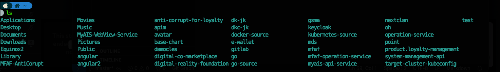
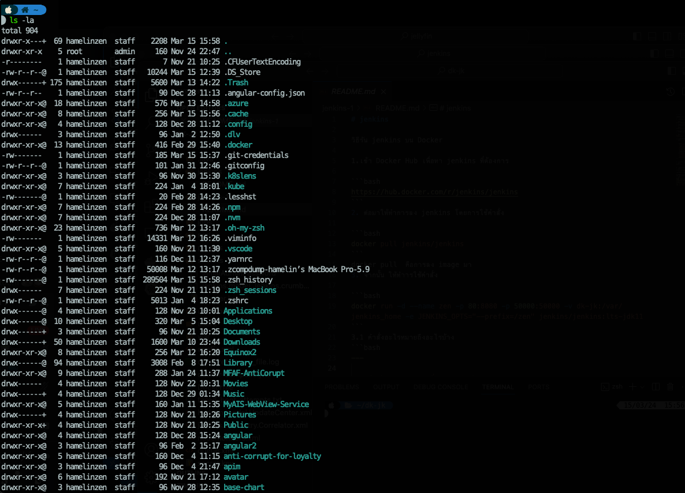
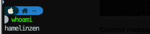
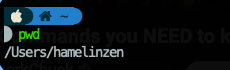
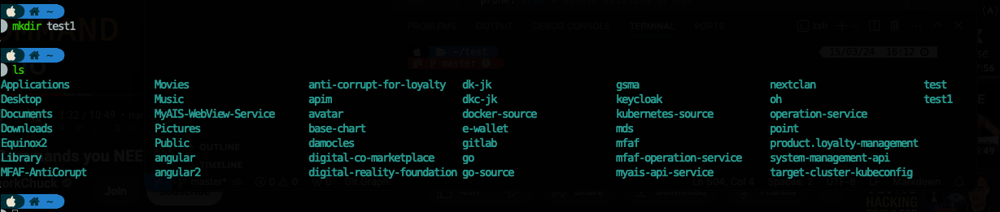
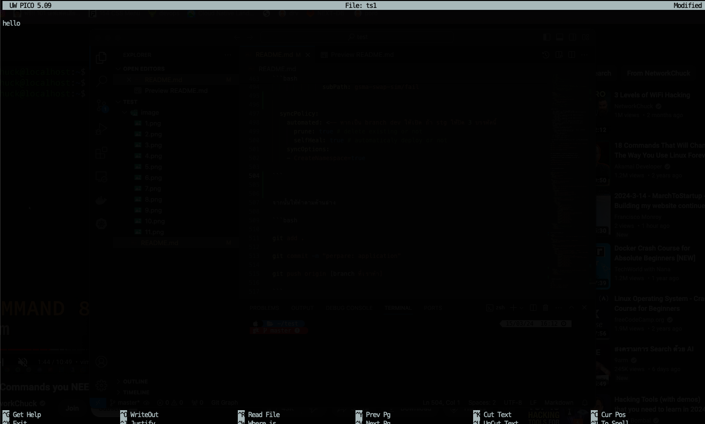
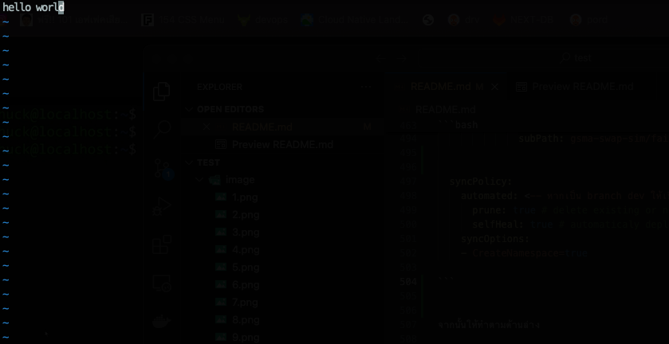
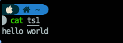
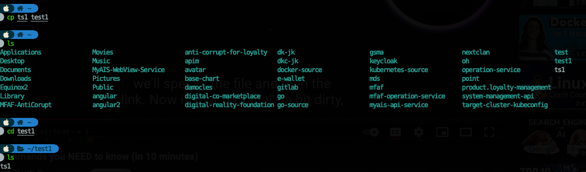

#Linux

คำสั่งพื้นฐาน การใช้งาน Linux


1.ls คือคำสั่งที่ไว้ list file ทั้งหมดที่อยู่ใน folder ที่เราอยู่

```bash
ls 
```


จะได้ตามรูปภาพ คือ list file ทั้งหมดที่อยู๋ใน floder home ทั้งหมด

2.ls -la  คือคำสั่งที่ไว้ list file ทั้งหมดที่อยู่ใน folder ที่เราอยู่ จะแสดง file และชื่อคนทำ group ขนาน file วันที่ เวลา และชื่อของ file นั้นๆ ทั้งหมดที่มี รวมถึงfile ที่ซ้อนเอาไว้

```bash
ls -la
```


จะได้ตามรูปภาพ คือ list file ทั้งหมดที่อยู๋ใน floder home ทั้งหมด

3. whoami คือคำสั่งไว้ check ว่า ปัจจุบันเราอยู่ที่ path ไหน

```bash
whoami
```


จากรูปจะเห็นได้ว่าปัจจุบันเราอยู่ในตำแหน่งไหน 
4. pwd คือเช็ค path ที่เราอยู่เช่นเดียวกับ whoami แต่คำสั่งนี้จำแสดง path file มาด้วยว่าเรา เข้าผ่านอะไรบ้าง และตอนนี้อยู๋ที่ไหน

```bash
pwd
```


จากตามรูปเราจะเห็นได้ว่า ปัจจุบันเราอยู่ที่ไหนและ path อะไร

5. mkdir คือการสร้าง folder ขึ้นมา
```bash
mkdir (name folder)

ex. mkdir test1
```


จะได้ floder ตามรูปที่สร้าง และ check ด้วย ls ก็จะเห็น folder ที่สร้างขึ้นมา

ุ6.nano คือการสร้าง file ขึ้นมาในรูปแบบของ linux ที่สามารถใส่ข้อมู,หรือ note ไว้ และ สามารถแปลงไฟล์เอาไปใช้กับ file อื่นๆได้

```bash
nano (name file)

ex.nano ts1

hello

```


จากในรูปนั้น เราใส่คำว่า hello เข้าไปเพื่อเก็บข้อมูล จากนั้นให้ทำการออกมาโดยกด ctrl+X และกด Y จากนั้นกด enter ก็ออกกมา

7.vim คือคำสั่งที่เข้าไปแก้ไขใน file ของ nano ที่เราสร้างขึ้นมา

```bash
vim (name file)

ex.vim ts1

hello world 

```


เราเข้าไปแก้ไข file โดยการ vim เข้าไป กดตัว I เพื่อ insert เพิ่มคำว่า word เข้าไป จากนั้นกด esc และ ใช้คำสั่ง wq! เพื่อบันทึกและออกจากหน้านั้น

8. cat คือคำสั่งที่อ่าน file โดยที่เราไม่ต้องเข้าไปใน file นั้นๆได้

```bash
cat (name file)

ex.cat ts1

hello world 

```



ตามในรูปภาพก็จะแสดงข้อมูลข้างในออกมา

9. cp คือคำสั่ง copy + paste ได้ไม่ว่าจะ file หรือ folder
```bash
cp (name file) to (name folder)

ex.cp ts1 test1

cd test1

ls

```


จากรูปจะเห็นได้ว่า ใช้คำสั่ง cp ts1 เพื่อเอา ts1 นั้นไปอยู่ที่ folder test1 และใช้คำสั่ง cd test1 เพื่อเข้า folder test1 และ ใช้ ls เพื่อเช็คว่า file มาหรือไม่

12. apt-get คือการลงโปรแกรมในเครื่อง เช่นลง docker

```bash
sudo apt-get install docker-ce docker-ce-cli containerd.io docker-buildx-plugin docker-compose-plugin

```


จะเป็นการลง docker ในเครื่อง โดยใช้ apt-get